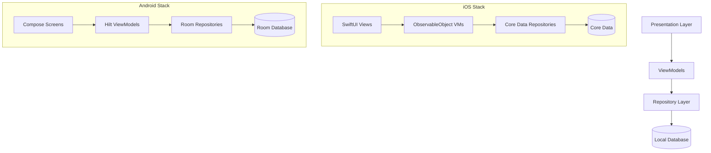

# 💰 Finora - Personal Finance Management App

<div align="center">

**Elegant Glassmorphism Design × Intelligent Finance Management × 100% Offline**

[](https://reactnative.dev/)
[](https://expo.dev/)
[](https://www.typescriptlang.org/)
[]()
[]()

</div>

---

## 📖 Table of Contents

- [Overview](#overview)
- [Core Features](#core-features)
- [Latest Updates](#latest-updates)
- [Tech Stack](#tech-stack)
- [Quick Start](#quick-start)
- [Documentation](#documentation)
- [Project Structure](#project-structure)
- [Roadmap](#roadmap)

---

## 🌟 Overview

**Finora** is a modern personal finance management application built with **React Native** and **Expo**. It features an elegant **glassmorphism design** with intuitive UI and powerful financial tracking capabilities.

### ✨ Key Highlights

- 🎨 **Glassmorphism UI** - Beautiful frosted glass effects with Dark/Light themes
- 💳 **Multi-Passbook System** - Manage multiple accounts with custom colors
- 📊 **Smart Analytics** - Interactive charts showing income/expense trends
- 👆 **Swipe Gestures** - Intuitive swipe-to-delete transactions
- 🔒 **100% Offline** - Complete local storage, no internet required
- 🌐 **Bilingual** - Traditional Chinese (繁體中文) & English
- 🎭 **Theme Switching** - Full Dark Mode & Light Mode support
- �️ **Local Icons** - Beautiful icons, no network required

---

## 🎯 Core Features

### 🏠 Home Screen
- ✅ Total balance & account cards (2-column grid)
- ✅ Quick action buttons: Add income/expense
- ✅ Recent transactions list (last 5)
- ✅ Swipe-to-delete transactions
- ✅ View all transactions
- ✅ Auto-calculated balances with real-time updates

### 💳 Check (Passbook) Screen
- ✅ Display all passbook cards
- ✅ Monthly income, expenses, balance statistics
- ✅ Month navigation: View different months
- ✅ Color-coded passbooks
- ✅ Auto year-end handling

### ➕ Add Transaction Screen
- ✅ Income/Expense toggle switch
- ✅ Amount input with validation
- ✅ Optional notes field
- ✅ 6 preset categories
- ✅ Horizontal passbook selector
- ✅ Auto-distribute toggle (UI ready)
- ✅ Persistent storage

### 📊 Statistics Screen
- ✅ Account filter (All/Individual accounts)
- ✅ Monthly income vs expense charts (last 6 months)
- ✅ Annual totals by account (bar charts)
- ✅ Key metrics cards: Total income, Total expenses, Net balance
- ✅ Real data integration (no mock data)

### ⚙️ Settings Screen
- ✅ **Language Switch** - Traditional Chinese / English
- ✅ **Theme Switch** - Dark Mode / Light Mode
- ✅ **Manage Passbooks** - Create/Edit/Delete accounts
- ✅ **Ratio Settings** - Auto-distribution ratios
- ✅ **Clear Data** - Reset all data
- ✅ **Feedback** - Local feedback storage

### 💼 Passbook Management
- ✅ Create new passbooks (custom name & color)
- ✅ Edit existing passbooks
- ✅ Delete passbooks (cascade delete transactions)
- ✅ **12 Preset Colors + Custom Hex Colors** ✨
- ✅ Real-time color preview
- ✅ Format validation

### � Feedback Screen
- ✅ Contact form with name, email, subject, message
- ✅ Local storage backup
- ✅ Discord webhook integration (optional)
- ✅ Gmail contact: serelixstudio@gmail.com
- ✅ Character counter (1000 max)
- ✅ Full Light/Dark mode support

### 📄 All Transactions Screen
- ✅ Complete transaction history
- ✅ Swipe-to-delete with confirmation
- ✅ Grouped by passbook
- ✅ Color-coded amounts (green/red)
- ✅ Full translation support
- ✅ Empty state handling

---

## 🆕 Latest Updates (v2.3.0)

### ✨ Session 9 Updates - Light Mode Completion

#### 🎨 Full Light Mode Implementation
- ✅ **SettingsScreen** - Complete Light/Dark theme support
- ✅ **AllTransactionsScreen** - Full theme + translation support
- ✅ **FeedbackScreen** - Complete Light/Dark theme support
- ✅ **StatisticsScreen** - Full chart and metrics theme support
- ✅ **HomeScreen** - Already complete (previous sessions)
- ✅ **CheckScreen** - Already complete (previous sessions)
- ✅ Dynamic theme colors applied to ALL UI elements
- ✅ Removed all hardcoded colors from StyleSheets

#### 📚 Comprehensive Documentation
- ✅ Created FINAL_SUMMARY.md (2000+ lines)
- ✅ Updated README.md with accurate project info
- ✅ All documentation reflects current implementation

### 📋 Session 8 Updates - UI Fixes & Enhancements
- ✅ Centered passbook titles on Home screen
- ✅ Hidden bottom tab bar labels (icons only)
- ✅ Chinese/English translations for Statistics & Settings
- ✅ Gmail contact info in Feedback screen
- ✅ Fixed swipe-to-delete gestures
- ✅ Conditional "Total by Account" display
- ✅ Partial Light Mode implementation (header elements)

### 🔒 Previous Updates - Complete Offline
- ✅ Removed all network dependencies
- ✅ Local icon support (assets/icons/)
- ✅ Feedback local storage
- ✅ 100% airplane mode compatible

---

## 🛠️ Tech Stack

### Frontend Framework
- **React Native 0.81.4** - Cross-platform mobile development
- **Expo SDK 54.0.13** - Development toolchain & native modules
- **TypeScript 5.9.2** - Type-safe JavaScript superset

### Navigation
- **React Navigation v7** - Screen navigation
  - Stack Navigator - Modal screens (Passbook Management)
  - Bottom Tabs Navigator - Main 5 tabs

### Data Management
- **AsyncStorage** - Local data persistence
- **React Hooks** - State management & lifecycle
  - `useState` - Component local state
  - `useEffect` - Side effects & data loading
  - `useFocusEffect` - Auto-refresh on screen focus
  - `useCallback` - Performance optimization

### UI Components & Styling
- **React Native Core** - View, Text, ScrollView, Modal
- **react-native-gesture-handler** - Swipe gestures (Swipeable)
- **react-native-safe-area-context** - Safe area handling
- **Custom Glassmorphism Components** - GlassCard, GlassButton, BlurredBackground

### Theme System
Two complete color schemes with dynamic switching:

```typescript
THEME_COLORS = {
  dark: {
    background: '#111518',
    text: '#ffffff',
    card: '#1a2a32',
    primary: '#19a2e6',
    success: '#10b981',
    error: '#ff4757',
    // ... more colors
  },
  light: {
    background: '#f5f7fa',
    text: '#1a2a32',
    card: '#ffffff',
    primary: '#19a2e6',
    success: '#10b981',
    error: '#ff4757',
    // ... more colors
  }
}
```

**12 Passbook Colors (Morandi Palette)**:
```
#7B68EE (Blue)   | #87A96B (Green) | #9A8194 (Purple) | #E6D690 (Yellow)
#D4A5A5 (Pink)   | #B8B8B8 (Gray)  | #5A4FCF (Deep Blue) | #6B7B5A (Dark Green)
#19a2e6 (Sky)    | #E89A3C (Orange) | #ff4757 (Red)   | #3eaf7c (Cyan)
```

---

## 🚀 Quick Start

### Prerequisites

- **Node.js** 18+ 
- **npm** or **yarn**
- **Expo CLI** (auto-installed)
- **Expo Go App** (for physical device testing)

### Installation

```bash
# 1. Clone the repository
git clone https://github.com/yourusername/Finora_app.git
cd Finora_app

# 2. Install dependencies
npm install

# 3. Start development server
npx expo start

# 4. Run the app
# - Press 'i' for iOS Simulator
# - Press 'a' for Android Emulator
# - Scan QR code with Expo Go app on your phone
```

### Clear Cache & Restart

```bash
npx expo start --clear
```

### Build for Production

```bash
# Android APK
eas build --platform android

# iOS IPA
eas build --platform ios
```

---

## 📚 Documentation

### Quick Start Guides
- [Quick Start Guide](./quick-start.md) - Get started in 3 minutes
- [Complete Features List](./docs/FEATURES_COMPLETE.md) - 42+ features explained
- [Final Summary](./docs/FINAL_SUMMARY.md) - Comprehensive project documentation

### Setup Guides
- [Icons Setup](./docs/ICONS_SETUP.md) - ⭐ Recommended! 3-step setup
- [Local Icons Guide](./docs/LOCAL_ICONS_SETUP.md) - Complete tutorial
- [Offline Guide](./docs/OFFLINE_GUIDE.md) - 100% offline operation

### Development Docs
- [Changelog](./CHANGELOG.md) - Version history
- [Documentation Index](./docs/README.md) - All docs navigation

---

## 📂 Project Structure

```
Finora_app/
├── App.tsx                      # App entry point
├── app.json                     # Expo config
├── package.json                 # Dependencies
├── tsconfig.json                # TypeScript config
│
├── src/
│   ├── components/              # Reusable UI components
│   │   ├── BlurredBackground.tsx
│   │   ├── GlassButton.tsx
│   │   └── GlassCard.tsx
│   │
│   ├── models/                  # Data models & types
│   │   ├── index.ts
│   │   ├── Passbook.ts         # Passbook interface
│   │   ├── RatioSetting.ts     # Ratio settings
│   │   └── Transaction.ts      # Transaction interface
│   │
│   ├── navigation/              # Navigation setup
│   │   └── AppNavigator.tsx    # Stack + Tab navigator
│   │
│   ├── screens/                 # App screens
│   │   ├── AddScreen.tsx       # Add transaction
│   │   ├── AllTransactionsScreen.tsx  # All transactions list
│   │   ├── CheckScreen.tsx     # Passbook view
│   │   ├── FeedbackScreen.tsx  # Feedback form
│   │   ├── HomeScreen.tsx      # Home dashboard
│   │   ├── PassbookManagementScreen.tsx  # Passbook CRUD
│   │   ├── RatioSettingsScreen.tsx  # Ratio settings
│   │   ├── SettingsScreen.tsx  # Settings
│   │   └── StatisticsScreen.tsx # Statistics & charts
│   │
│   ├── services/                # Service layer
│   │   └── DataService.ts      # Data access (AsyncStorage)
│   │
│   ├── theme/                   # Theme & styles
│   │   ├── Colors.ts           # Color definitions (Dark/Light)
│   │   ├── Spacing.ts          # Spacing definitions
│   │   └── Typography.ts       # Font definitions
│   │
│   ├── context/                 # React Context
│   │   └── AppContext.tsx      # Global state (theme, language)
│   │
│   ├── config/                  # Configuration files
│   │   ├── app.config.ts       # App config & translations
│   │   └── feedback.config.ts  # Feedback config
│   │
│   └── utils/                   # Utility functions
│       └── formatting.ts       # Format helpers
│
├── assets/                      # Static assets
│   ├── icon.png
│   ├── splash-icon.png
│   ├── adaptive-icon.png
│   └── icons/                  # Local app icons
│
├── docs/                        # Documentation
│   ├── FINAL_SUMMARY.md        # Complete project summary
│   ├── FEATURES_COMPLETE.md    # Feature list
│   ├── OFFLINE_GUIDE.md        # Offline usage
│   └── ...
│
├── CHANGELOG.md                 # Version history
├── README.md                    # This file
└── package.json                 # Dependencies
```

---

## 🗺️ Roadmap

### ✅ Completed (v2.3.0)
- [x] 9 main screens with full UI implementation
- [x] Transaction CRUD with swipe-to-delete
- [x] AsyncStorage data persistence
- [x] Monthly passbook statistics
- [x] Complete Passbook CRUD system
- [x] Statistics with real data
- [x] Auto-refresh mechanism
- [x] **Complete Light/Dark Mode for ALL screens** ✨
- [x] **Full bilingual support** (Chinese/English)
- [x] **100% offline functionality**
- [x] **Comprehensive documentation**

### 📋 Planned (v2.4.0)
- [ ] Implement auto-distribute logic (60/30/10 ratios)
- [ ] Add transaction edit functionality
- [ ] Date picker for transactions
- [ ] Category-based icons
- [ ] Improved empty states

### 🚀 Future (v3.0+)
- [ ] Transfer between passbooks
- [ ] Transaction detail page
- [ ] Custom transaction categories
- [ ] Transaction search & filtering
- [ ] Monthly budget targets
- [ ] Data export (CSV)
- [ ] Recurring transactions
- [ ] Notifications (overspending alerts)
- [ ] Cloud backup & sync (optional)
- [ ] Multi-currency support

---

## 🤝 Contributing

Contributions are welcome! Please feel free to submit a Pull Request.

### Development Guidelines
- Follow TypeScript best practices
- Maintain consistent code style
- Add comments for new features
- Consider accessibility in UI changes
- Test in both Dark and Light modes
- Test in both languages (Chinese/English)

---

## 📄 License

This project is licensed under the **MIT License**. See [LICENSE](./LICENSE) for details.

---

## 📞 Contact

- **GitHub Issues**: [Report bugs or request features](https://github.com/yourusername/Finora_app/issues)
- **Email**: serelixstudio@gmail.com
- **Feedback**: Use in-app Feedback screen

---

<div align="center">

**Built with ❤️ using React Native & Expo**

*Making personal finance management elegant and simple*

[](https://github.com/yourusername/Finora_app)

</div>

<div align="center">

**優雅的玻璃擬態設計 × 智能財務管理 × 完全離線**

[](https://reactnative.dev/)
[](https://expo.dev/)
[](https://www.typescriptlang.org/)
[]()
[]()

</div>

---

## 📖 目錄

- [專案簡介](#專案簡介)
- [核心功能](#核心功能)
- [最新更新](#最新更新)
- [技術架構](#技術架構)
- [快速開始](#快速開始)
- [文件導覽](#文件導覽)
- [專案結構](#專案結構)

---

## 專案簡介

**Finora** 是一款使用 React Native + Expo 開發的現代化個人財務管理應用程式，採用優雅的**玻璃擬態設計風格**，提供直覺的介面與強大的財務追蹤功能。

### ✨ 特色亮點

- 🎨 **玻璃擬態設計** - 深色主題搭配半透明玻璃效果，視覺優雅舒適
- 💳 **多存摺系統** - 支援建立多個帳戶，靈活管理不同資金用途
- 📊 **智能數據分析** - 互動式圖表即時呈現收支狀況與趨勢
- 👆 **流暢手勢操作** - 支援左滑刪除等直覺手勢互動
- � **完全離線** - 100% 本地儲存，無需網路，保護隱私
- 🌐 **多語言支援** - 繁體中文 / English
- � **主題切換** - 深色模式 / 淺色模式
- �️ **本地圖示** - 精美圖示，無需網路載入

---

## 🎯 核心功能

### 🏠 首頁 (Home)
- ✅ 總餘額與帳戶卡片（2列網格）
- ✅ 快捷按鈕：一鍵新增收入或支出
- ✅ 最近交易列表（最近 5 筆）
- ✅ 左滑刪除交易功能
- ✅ 查看全部交易
- ✅ 自動計算餘額並即時更新

### 💳 存摺 (Check)
- ✅ 顯示所有存摺卡片
- ✅ 每月收入、支出、餘額統計
- ✅ 月份導航：查看不同月份的歷史記錄
- ✅ 彩色標示區分不同存摺
- ✅ 自動跨年處理

### ➕ 新增交易 (Add)
- ✅ 收入/支出快速切換
- ✅ 金額輸入與即時驗證
- ✅ 備註欄位（選填）
- ✅ 6 種預設類別選擇
- ✅ **存摺選擇** - 水平捲動選擇目標存摺
- ✅ 自動分配開關（UI 已完成，邏輯開發中）
- ✅ 資料持久化儲存

### 📊 統計分析 (Statistics)
- ✅ 帳戶篩選器（全部/個別存摺）
- ✅ 月度收支圖表（最近 6 個月）
- ✅ 帳戶年度總計條狀圖
- ✅ 關鍵指標卡片：總收入、總支出、淨餘額
- ✅ 真實資料整合（非假資料）

### ⚙️ 設定 (Settings)
- ✅ **語言切換** - 繁體中文 / English
- ✅ **主題切換** - 深色模式 / 淺色模式
- ✅ **管理存摺** - 新增/編輯/刪除存摺
- ✅ **比例設定** - 自動分配比例
- ✅ **清除資料** - 重置所有資料
- ✅ **意見反饋** - 本地儲存反饋

### 💼 存摺管理
- ✅ 建立新存摺（自訂名稱與顏色）
- ✅ 編輯現有存摺
- ✅ 刪除存摺（級聯刪除相關交易）
- ✅ **12 種預設配色 + 自訂 Hex 顏色** ✨
- ✅ 即時顏色預覽
- ✅ 格式驗證

---

## 🆕 最新更新 (v2.2.0)

### 🔒 完全離線化
- ✅ 移除所有網路依賴
- ✅ 本地圖示支援（assets/icons/）
- ✅ 意見反饋本地儲存
- ✅ 100% 飛行模式可用

### 🎨 新功能
- ✅ 自訂顏色（Hex 輸入）
- ✅ 本地圖示系統
- ✅ 5 個精美圖示已內建

### 📚 完整文件
- ✅ 14+ Markdown 文件
- ✅ 圖示設定指南
- ✅ 離線使用指南
- ✅ 功能完整清單

---

## 📚 文件導覽

### 快速開始
- [快速啟動指南](./quick-start.md) - 3 分鐘上手
- [功能完整清單](./docs/FEATURES_COMPLETE.md) - 42 個功能詳解

### 設定指南
- [圖示快速設定](./docs/ICONS_SETUP.md) - ⭐ 推薦！3 步驟設定
- [本地圖示詳細教學](./docs/LOCAL_ICONS_SETUP.md) - 完整教學
- [離線使用指南](./docs/OFFLINE_GUIDE.md) - 100% 離線運作

### 開發文件
- [完整更新日誌](./CHANGELOG.md) - 版本歷史
- [文件索引](./docs/README.md) - 所有文件導覽

---

## 技術架構

### 前端框架
- **React Native 0.81.4** - 跨平台行動應用開發
- **Expo SDK 54.0.13** - 開發工具鏈與原生模組
- **TypeScript** - 型別安全的 JavaScript 超集

### 導航系統
- **React Navigation v7** - 畫面導航管理
  - Stack Navigator - 模態畫面（存摺管理）
  - Bottom Tabs Navigator - 主要五個分頁

### 資料管理
- **AsyncStorage** - 本地資料持久化儲存
- **React Hooks** - 狀態管理與生命週期
  - `useState` - 組件本地狀態
  - `useEffect` - 副作用與資料載入
  - `useFocusEffect` - 畫面聚焦時自動刷新
  - `useCallback` - 效能優化

### UI 組件與樣式
- **React Native 核心組件** - View, Text, ScrollView, Modal 等
- **react-native-gesture-handler** - 手勢處理（Swipeable）
- **react-native-safe-area-context** - 安全區域處理
- **自訂玻璃擬態組件** - GlassCard, GlassButton, BlurredBackground

### 配色系統
採用**莫蘭迪色系**（Morandi Colors），營造優雅舒適的視覺體驗：

```typescript
主題色:
- 背景色: #111518 (深灰)
- 卡片背景: #293338 (次深灰)
- 主色調: #19a2e6 (天藍)
- 成功色: #10b981 (綠)
- 危險色: #ff4757 (紅)

存摺配色 (12 色):
#7B68EE (藍) | #87A96B (綠) | #9A8194 (紫) | #E6D690 (黃)
#D4A5A5 (粉) | #B8B8B8 (灰) | #5A4FCF (深藍) | #6B7B5A (暗綠)
#19a2e6 (天藍) | #E89A3C (橙) | #ff4757 (紅) | #3eaf7c (青)
```

---

## 快速開始

### 環境需求

- **Node.js** 18+ 
- **npm** 或 **yarn**
- **Expo CLI** (會自動安裝)
- **Expo Go App** (用於實體裝置測試)

### 安裝步驟

```bash
# 1. 複製專案
git clone https://github.com/yourusername/Finora_app.git
cd Finora_app

# 2. 安裝相依套件
npm install

# 3. 啟動開發伺服器
npx expo start

# 4. 選擇運行方式
# - 按 'i' 在 iOS 模擬器中開啟
# - 按 'a' 在 Android 模擬器中開啟  
# - 掃描 QR Code 在實體裝置上使用 Expo Go 測試
```

### 清除快取重新啟動

```bash
npx expo start --clear
```

### 建置發布版本

```bash
# Android APK
eas build --platform android

# iOS IPA
eas build --platform ios
```

---

## 畫面預覽

### 主要畫面

| 首頁 | 存摺 | 新增交易 |
|------|------|----------|
| 顯示總餘額與最近交易 | 多存摺月度統計 | 快速記帳介面 |
|  |  |  |

| 統計分析 | 設定 | 存摺管理 |
|----------|------|----------|
| 視覺化圖表分析 | 功能設定中心 | CRUD 存摺介面 |
|  |  |  |

> *註：截圖待補充*

---

## 專案結構

```
Finora_app/
├── App.tsx                      # 應用程式進入點
├── app.json                     # Expo 配置檔
├── package.json                 # 專案相依套件
├── tsconfig.json                # TypeScript 配置
│
├── src/
│   ├── components/              # 可重複使用的 UI 組件
│   │   ├── BlurredBackground.tsx
│   │   ├── GlassButton.tsx
│   │   └── GlassCard.tsx
│   │
│   ├── models/                  # 資料模型與型別定義
│   │   ├── index.ts
│   │   ├── Passbook.ts         # 存摺介面
│   │   ├── RatioSetting.ts     # 比例設定
│   │   └── Transaction.ts      # 交易介面
│   │
│   ├── navigation/              # 導航設定
│   │   └── AppNavigator.tsx    # Stack + Tab 導航器
│   │
│   ├── screens/                 # 應用程式畫面
│   │   ├── AddScreen.tsx       # 新增交易
│   │   ├── CheckScreen.tsx     # 存摺檢視
│   │   ├── HomeScreen.tsx      # 首頁
│   │   ├── PassbookManagementScreen.tsx  # 存摺管理
│   │   ├── SettingsScreen.tsx  # 設定
│   │   └── StatisticsScreen.tsx # 統計分析
│   │
│   ├── services/                # 服務層
│   │   └── DataService.ts      # 資料存取服務 (AsyncStorage)
│   │
│   ├── theme/                   # 主題與樣式
│   │   ├── Colors.ts           # 顏色定義
│   │   ├── Spacing.ts          # 間距定義
│   │   └── Typography.ts       # 字體定義
│   │
│   └── utils/                   # 工具函數
│       └── formatting.ts       # 格式化工具
│
├── assets/                      # 靜態資源
│   ├── icon.png
│   ├── splash-icon.png
│   └── adaptive-icon.png
│
├── CHANGELOG.md                 # 完整更新日誌（繁體中文）
├── IMPLEMENTATION_SUMMARY.md    # 實作總結
└── README.md                    # 本文件
```

---

## 資料流程

### 新增交易完整流程

```
使用者點擊首頁的 "＋收入" 或 "－支出"
         ↓
導航至 AddScreen (帶入 isIncome 參數)
         ↓
AddScreen 載入存摺列表 (useFocusEffect 自動刷新)
         ↓
使用者填寫表單:
  - 選擇收入/支出類型
  - 輸入金額 (必填, >0)
  - 輸入備註 (選填)
  - 選擇交易類別 (必填)
  - 選擇目標存摺 (必填)
         ↓
點擊 "Complete" 按鈕 → handleComplete() 執行
         ↓
驗證表單 → 建立 Transaction 物件
         ↓
DataService.saveTransaction() → 儲存至 AsyncStorage
         ↓
顯示成功 Alert → 自動返回首頁
         ↓
HomeScreen useFocusEffect 觸發 → 重新載入資料
         ↓
畫面更新：顯示新交易、更新餘額
```

### 存摺管理流程

```
設定畫面 → 點擊 "管理存摺" (💳)
         ↓
導航至 PassbookManagementScreen
         ↓
載入所有存摺 (loadPassbooks)
         ↓
使用者操作:
  
  【新增存摺】
  點擊 ➕ → 輸入名稱 → 選擇顏色 → 儲存
       ↓
  DataService.createPassbook() → AsyncStorage
       ↓
  重新載入列表 → 顯示新存摺
  
  【編輯存摺】
  點擊 "編輯" → 修改內容 → 更新
       ↓
  DataService.updatePassbook() → AsyncStorage
       ↓
  重新載入列表 → 顯示變更
  
  【刪除存摺】
  點擊 "刪除" → 確認警告對話框
       ↓
  DataService.deletePassbook() → 級聯刪除交易
       ↓
  重新載入列表 → 移除項目
         ↓
返回上一頁 (設定或新增交易)
         ↓
目標畫面 useFocusEffect 觸發 → 自動顯示最新資料
```

---

## 開發路線圖

### ✅ 已完成 (v0.3.0)
- [x] 5 個主要畫面的 UI 實作
- [x] 交易新增與刪除功能
- [x] 左滑刪除手勢
- [x] AsyncStorage 資料持久化
- [x] 存摺月度統計
- [x] **完整的存摺 CRUD 系統**
- [x] **統計畫面真實資料整合**
- [x] **自動刷新機制**

### 🚧 開發中 (v0.4.0)
- [ ] 實作自動分配邏輯（60/30/10 比例）
- [ ] 新增交易編輯功能
- [ ] 新增日期選擇器
- [ ] 根據類別顯示對應圖示
- [ ] 改善空狀態設計

### 📋 規劃中 (v0.5.0+)
- [ ] 存摺間轉帳功能
- [ ] 交易詳情頁面
- [ ] 自訂交易類別
- [ ] 交易搜尋與篩選
- [ ] 月度預算設定
- [ ] 資料匯出 (CSV)

### 🔮 未來展望 (v1.0+)
- [ ] 定期交易（如：每月薪資）
- [ ] 通知提醒（超支警告）
- [ ] 雲端備份與同步
- [ ] 多幣別支援
- [ ] 收據拍照與 OCR
- [ ] 多人帳本共享

詳細更新日誌請參閱 [CHANGELOG.md](./CHANGELOG.md)

---

## 已知問題

### TypeScript 編譯警告
```
Cannot use JSX unless the '--jsx' flag is provided
```
**影響**: 無（Expo 自動處理）  
**狀態**: 可忽略，不影響執行

### 功能待完善
1. **自動分配**: UI 已完成，60/30/10 比例邏輯尚未實作
2. **交易編輯**: 目前僅支援刪除
3. **日期選擇**: 交易日期固定為當前時間
4. **分類圖示**: 列表中所有交易顯示相同圖示

---

## 貢獻指南

歡迎提交 Issue 或 Pull Request！

### 開發規範
- 遵循 TypeScript 最佳實踐
- 保持程式碼風格一致
- 新增功能需包含註解說明
- UI 變更需考慮無障礙設計

---

## 授權條款

本專案採用 **MIT License** 授權。

詳見 [LICENSE](./LICENSE) 文件。

---

## 聯絡資訊

- **Issue 回報**: [GitHub Issues](https://github.com/yourusername/Finora_app/issues)
- **功能建議**: [GitHub Discussions](https://github.com/yourusername/Finora_app/discussions)
- **Email**: support@finora.app

---

<div align="center">

**用 ❤️ 打造的個人財務管理應用**

*讓記帳變得優雅而簡單*

[](https://github.com/yourusername/Finora_app)

</div>

### ✨ Key Features

- 🎨 **Glassmorphism UI Design** - Apple Glass-inspired interface with frosted glass effects
- 💰 **Multi-Passbook System** - Organize finances across multiple digital wallets
- ⚡ **Smart Ratio Distribution** - Auto-distribute income using 50/30/20 rule (customizable)
- 📊 **Interactive Analytics** - Beautiful charts and financial insights
- 🗂️ **Category Management** - Intelligent expense categorization
- 👆 **Swipe Gestures** - Intuitive swipe-to-delete functionality
- 🌙 **Offline-First** - Complete functionality without internet connectivity
- ♿ **Accessibility Ready** - Full VoiceOver/TalkBack support

## 📱 Platforms & Technology

### iOS Implementation
- **Framework**: SwiftUI 5.0+
- **Database**: Core Data
- **Architecture**: MVVM + Combine
- **Charts**: Swift Charts
- **Minimum**: iOS 15.0+

### Android Implementation  
- **Framework**: Jetpack Compose
- **Database**: Room (SQLite)
- **Architecture**: MVVM + Flow/Coroutines
- **Charts**: Custom Canvas Charts
- **Minimum**: API 26 (Android 8.0)

## 🏗️ Architecture Overview



## 🎨 Design System

### Glassmorphism Components
- **GlassCard**: Frosted container with blur effects and subtle borders
- **GlassButton**: Translucent interactive elements with hover states  
- **BlurredBackground**: Multi-layer gradient backgrounds with glass effects
- **Charts**: Custom glass-styled data visualizations

### Color Palette (Morandi Colors)
```swift
// Soft, calming colors inspired by Giorgio Morandi
Primary Blue: #7B68EE    // Serene lavender blue
Sage Green: #87A96B      // Muted natural green  
Dusty Purple: #9A8194    // Gentle mauve purple
Warm Yellow: #E6D690     // Soft golden yellow
Blush Pink: #D4A5A5      // Subtle rose pink
```

## 📂 Project Structure

```
Budget Glass/
├── iOS/                          # Native iOS SwiftUI app
│   ├── BudgetGlass/
│   │   ├── App/                  # App configuration
│   │   ├── Models/              # Core Data models
│   │   ├── Views/               # SwiftUI screens
│   │   ├── ViewModels/          # Business logic
│   │   ├── Repositories/        # Data access
│   │   ├── Components/          # Reusable UI components
│   │   ├── Utils/               # Utilities & extensions
│   │   └── Resources/           # Assets & localization
│   └── README.md
│
├── Android/                      # Native Android Compose app
│   ├── app/src/main/java/com/budgetglass/
│   │   ├── data/                # Database & repositories
│   │   ├── domain/              # Business models
│   │   ├── presentation/        # UI layer
│   │   │   ├── ui/
│   │   │   │   ├── screens/     # Compose screens
│   │   │   │   ├── components/  # Reusable components
│   │   │   │   ├── navigation/  # Navigation setup
│   │   │   │   └── theme/       # Material 3 theming
│   │   │   └── viewmodel/       # Hilt ViewModels
│   │   └── di/                  # Dependency injection
│   └── README.md
│
├── CROSS_PLATFORM_PARITY.md     # Feature parity documentation
└── README.md                     # This file
```

## 🚀 Getting Started

### iOS Development Setup

```bash
# Clone the repository
git clone https://github.com/yourusername/budget-glass.git
cd budget-glass/iOS

# Open in Xcode
open BudgetGlass.xcodeproj

# Install dependencies (if using SPM)
# Dependencies are managed via Xcode's built-in SPM integration

# Build and run
# Press ⌘+R in Xcode or use Product > Run
```

**Requirements:**
- Xcode 15.0+
- iOS 15.0+ target device/simulator
- macOS Sonoma (for development)

### Android Development Setup

```bash
# Clone the repository  
git clone https://github.com/yourusername/budget-glass.git
cd budget-glass/Android

# Build the project
./gradlew build

# Install on device/emulator
./gradlew installDebug

# Run tests
./gradlew test
```

**Requirements:**
- Android Studio Hedgehog (2023.1.1)+
- Android SDK 26+ (API level 26)
- Kotlin 1.9+

## 🎯 Core Features Deep Dive

### 1. Smart Ratio Distribution System
Automatically distributes income across passbooks using the proven **50/30/20 budgeting rule**:
- 🏠 **50% Needs**: Essential expenses (rent, utilities, groceries)
- 🎮 **30% Wants**: Discretionary spending (entertainment, dining)
- 💰 **20% Savings**: Emergency fund and investments

*Ratios are fully customizable in Settings*

### 2. Multi-Passbook Architecture
Organize your finances across multiple digital wallets:
- Color-coded passbook system
- Independent balance tracking
- Category-based transaction filtering
- Cross-passbook analytics and insights

### 3. Glassmorphism Design Language
Premium Apple Glass-inspired interface:
- Frosted glass containers with realistic blur effects
- Subtle shadows and depth layers
- Morandi color palette for visual calm
- Smooth animations and micro-interactions

### 4. Advanced Analytics
Comprehensive financial insights:
- Interactive pie charts for expense categories
- Monthly trend analysis with line graphs
- Passbook comparison visualizations
- Time-range filtering (week/month/quarter/year)

## 📊 Screenshots

<div align="center">

| iOS | Android |
|-----|---------|
|  |  |
|  |  |
|  |  |

</div>

## ♿ Accessibility Features

Budget Glass is designed with accessibility as a first-class feature:

### iOS Accessibility
- **VoiceOver**: Complete screen reader support with custom rotor controls
- **Dynamic Type**: Supports all iOS text size preferences  
- **High Contrast**: Automatic color adjustments for visual accessibility
- **Reduce Motion**: Respects motion sensitivity preferences
- **Voice Control**: Full voice navigation support

### Android Accessibility
- **TalkBack**: Comprehensive screen reader optimization
- **Text Scaling**: Supports Android's accessibility text sizing
- **Color Contrast**: WCAG AA compliant color ratios
- **Touch Assistance**: Minimum 48dp touch targets
- **Switch Access**: External switch device compatibility

## 🧪 Testing & Quality Assurance

### Automated Testing
- **iOS**: XCTest unit tests for business logic and ViewModels
- **Android**: JUnit + Mockito tests for repositories and ViewModels
- **UI Testing**: XCUITest (iOS) and Espresso (Android) for user flows

### Manual Testing Checklist
- [ ] Cross-platform visual parity verification
- [ ] Accessibility testing with screen readers
- [ ] Performance testing on low-end devices  
- [ ] Edge case handling (empty states, network failures)
- [ ] Multi-language support validation

## 🔐 Privacy & Security

Budget Glass prioritizes user privacy:
- **Local-Only Storage**: All financial data stored locally on device
- **No Analytics Tracking**: Zero user behavior tracking
- **No Network Requests**: Complete offline functionality
- **Data Export Control**: Users control their own data export/import
- **Biometric Security**: Optional Face ID/Touch ID and fingerprint protection

## 🌍 Localization Support

Currently supported languages:
- 🇺🇸 English (Default)

**Planned Languages:**
- 🇪🇸 Spanish
- 🇫🇷 French  
- 🇩🇪 German
- 🇨🇳 Chinese (Simplified)
- 🇯🇵 Japanese

## 📋 Roadmap

### Version 1.1 (Q1 2026)
- [ ] Biometric authentication
- [ ] Data export to CSV/PDF
- [ ] Budget goals and alerts
- [ ] Recurring transaction templates

### Version 1.2 (Q2 2026)  
- [ ] Multi-currency support
- [ ] Advanced filtering and search
- [ ] Custom category creation
- [ ] Dark mode optimization

### Version 2.0 (Q3 2026)
- [ ] Cloud sync (optional, encrypted)
- [ ] Collaboration features for families
- [ ] Investment tracking integration
- [ ] AI-powered spending insights

## 🤝 Contributing

We welcome contributions from the community! Please see our [Contributing Guide](CONTRIBUTING.md) for details.

### Development Guidelines
- Follow platform-specific code style (Swift for iOS, Kotlin for Android)
- Maintain visual parity between platforms
- Include accessibility considerations in all UI changes
- Add tests for new functionality
- Update documentation for new features

## 📄 License

Budget Glass is licensed under the MIT License. See [LICENSE](LICENSE) for details.

## 🙏 Acknowledgments

- **Design Inspiration**: Apple's glassmorphism and Material Design principles
- **Color Palette**: Inspired by Giorgio Morandi's artistic color theory
- **Architecture Patterns**: Clean Architecture by Robert Martin
- **Accessibility Guidelines**: WCAG 2.1 AA standards

## 📞 Support & Contact

- **Issues**: [GitHub Issues](https://github.com/yourusername/budget-glass/issues)
- **Discussions**: [GitHub Discussions](https://github.com/yourusername/budget-glass/discussions)
- **Email**: support@budgetglass.app
- **Website**: [www.budgetglass.app](https://www.budgetglass.app)

---

<div align="center">

**Built with ❤️ for iOS and Android**

*Making personal finance management beautiful and accessible for everyone*

</div>